# 🚀 **Spring WebSocket Chat Server**

STOMP + Redis Pub/Sub 기반의 **실시간 멀티룸 채팅 서버**

[](https://github.com/tak002/Spring-Redis-PubSub/actions)
[](https://github.com/tak002/Spring-Redis-PubSub/releases)

---

## 🖼️ **Demo**


---

## ✨ **Features**

* STOMP 기반 멀티룸 실시간 채팅
* Redis Pub/Sub을 통한 서버 간 메시지 동기화
* Docker + GitHub Actions 기반 자동 배포
* 채팅 기록 저장 및 조회 API 제공

---

## 🔮 **Planned Features**

* JWT 인증 및 WebSocket 인증 완성
* 대규모 트래픽 부하 테스트 및 최적화
* 테스트 자동화 (단위 / 통합 / E2E)
* 성능 모니터링 및 로깅 개선

---

## 📦 **모듈 구조**

### 🔹 **`chat-ws` – 실시간 메시지 송수신**

* WebSocket 기반 STOMP 메시징
* 멀티 인스턴스 간 Redis Pub/Sub 브로드캐스트
* 클라이언트 연결 관리 (입장/퇴장, Heartbeat 등)

### 🔹 **`chat-auth` – 인증 및 토큰 관리**

* 회원가입 및 로그인
* JWT 토큰 발급 / 검증
* 향후 OAuth2, 소셜 로그인 확장 예정

### 🔹 **`chat-history` – 대화 내역 저장 및 조회**

* 메시지 저장 및 조회 API
* PostgreSQL 기반 영속성 관리
* 방 단위 대화 내역 페이징 조회
* 검색 / 필터링 / 삭제 기능 확장 예정

---

## 🌿 **브랜치 전략**

### 🔧 **기능 개발**

* 브랜치명: `feat/기능명`
* 각 기능은 `feat/기능명` 브랜치에서 개발
* 완료 후 `main` 브랜치로 PR 생성

### 🧩 **코드 리뷰 및 통합**

* 대상 브랜치: `main`
* 모든 PR은 `main`을 기준으로 생성
* 코드 리뷰 및 테스트 완료 후 머지

### 🚀 **배포 및 실환경 테스트**

* 배포용 브랜치: `production`
* `main` → `production`으로 머지 시 배포 진행
* 환경 설정이나 긴급 수정은 `production`에서 직접 가능
* 단, `production` 변경사항은 반드시 `main`으로 PR 반영

### 🔁 **브랜치 흐름 예시**

```
1️⃣ feat/기능명 ─▶ main           # 기능 개발 후 PR 및 머지
2️⃣ main ─▶ production            # 배포 및 실환경 테스트
3️⃣ production ─▶ main            # 배포 관련 수정사항 반영
4️⃣ production                    # 배포 실행
```

---

## ⚙️ **배포 방식 (CI/CD)**

### 🧱 **자동화 도구**

* **GitHub Actions** 기반
* `main` 또는 `production` 푸시 시 자동 빌드 & 배포

### 🔨 **빌드 단계**

* Gradle로 `chat-ws`, `chat-history` JAR 생성
* Docker 이미지 빌드 후 **GitHub Container Registry**로 푸시
  (태그: `latest`, `commit SHA`)

### 🚀 **배포 단계**

* 운영 서버에 SSH 접속
* Docker Compose(`base + prod`)로 서비스 무중단 업데이트
* Postgres, Redis 등 상태 서비스는 유지됨

### 🔐 **환경 변수 관리**

* GitHub Secrets을 통해 다음 정보 자동 주입

  * API 경로
  * 인증 토큰
  * CORS 허용 도메인 등

### 🗂️ **관련 파일**

| 목적                      | 파일 경로                                                                                    |
| ----------------------- | ---------------------------------------------------------------------------------------- |
| CI/CD 워크플로우             | [`.github/workflows/deploy.yml`](./.github/workflows/deploy.yml)                         |
| Docker Compose (기본 설정)  | [`infra/docker-compose.base.yml`](./infra/docker-compose.base.yml)                       |
| Docker Compose (운영 환경)  | [`infra/docker-compose.prod.yml`](./infra/docker-compose.prod.yml)                       |

```mermaid
sequenceDiagram
    autonumber
    
    participant Client as 클라이언트<br/>(웹 브라우저)
    participant WS as chat-ws<br/>(WebSocket 서버)
    participant Redis as Redis<br/>(Pub/Sub)
    participant History as chat-history<br/>(메시지 저장 서버)
    participant DB as PostgreSQL<br/>(데이터베이스)

    Note over Client,DB: 1️⃣ 초기 연결 및 히스토리 로드
    
    Client->>+WS: WebSocket 연결 (SockJS/STOMP)
    WS-->>-Client: 연결 확인 (SessionConnected)
    
    Client->>+WS: SUBSCRIBE /topic/{roomId}
    WS-->>-Client: 구독 확인
    
    Client->>+History: GET /{roomId}/messages
    History->>+DB: SELECT * FROM chat_message<br/>WHERE room_id = ? AND is_deleted = false
    DB-->>-History: 과거 메시지 목록
    History-->>-Client: ChatMessagesReceiveDto<br/>(과거 대화 내역)

    Note over Client,DB: 2️⃣ 메시지 송수신 플로우

    Client->>+WS: SEND /app/chat<br/>ChatMessageSendDto {sender, content, roomId}
    
    WS->>+Redis: PUBLISH chat-message<br/>ChatMessagePubSubDto {tempId, sender, content, roomId}
    
    Note over Redis: Redis Pub/Sub으로<br/>모든 인스턴스에 브로드캐스트
    
    Redis-->>WS: chat-message 이벤트
    WS->>Client: SEND /topic/{roomId}<br/>ChatMessageReceiveDto {id: tempId, createdAt: null}
    Note over Client: 임시 ID로 메시지 즉시 표시<br/>(낙관적 UI 업데이트)
    
    Redis-->>+History: chat-message 이벤트<br/>RedisChatMessageSubscriber
    
    History->>+DB: INSERT INTO chat_message<br/>(sender, content, room_id)
    DB-->>-History: 저장 완료<br/>(id, created_at, edited_at 자동 생성)
    
    History->>+Redis: PUBLISH chat-timestamp<br/>ChatTimestampPubSubDto {id, tempId, createdAt, editedAt}
    
    Redis-->>WS: chat-timestamp 이벤트
    WS->>-Client: SEND /topic/{roomId}<br/>ChatTimestampReceiveDto {id, tempId, createdAt, editedAt}
    
    Note over Client: tempId를 실제 id로 교체<br/>타임스탬프 업데이트

    Note over Client,DB: 3️⃣ 멀티 인스턴스 동기화

    Redis-->>WS: chat-message 이벤트
    Note over WS: 다른 인스턴스의<br/>WebSocket 클라이언트들
    WS->>Client: SEND /topic/{roomId}<br/>동일한 메시지 브로드캐스트

    Note over Client,DB: 4️⃣ 연결 종료

    Client->>WS: UNSUBSCRIBE /topic/{roomId}
    Client->>WS: DISCONNECT
    WS-->>Client: SessionDisconnect 이벤트
```



